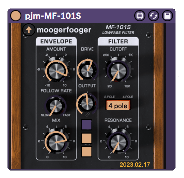
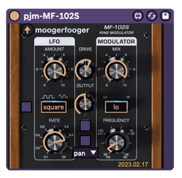

pjm-moogerfooger - Max for Live device wrappers for Moogerfooger plugins
--------------------------------------------------------------------------------

This is a Max for Live Audio Effect device. It is a wrapper over the [Moog
Moogerfooger plugins], which you must already have installed on your box.

The "skins" for the devices were created by screenshotting the devices on
my computer, and then placing them in the patcher window.  

Each device has a small "up arrow" control near the top left, that can
be used to open the actual plugin to interact with it.

No idea how to get existing factory presets available in the Live device;
you can list them, but not set them.  To use a preset, open the actual
plugin (see above), select the preset, and the Live device's settings
will change to that, so you can create a Live preset for those.

[Moog Moogerfooger plugins]: https://www.moogmusic.com/products/moogerfooger-effects-plug-ins

usage
================================================================================

Download the [latest version](https://github.com/pmuellr/pjm-moogerfooger/archive/refs/heads/main.zip).

Extract the contents of the archive, and drag the `*.amxd` files to your 
User Library.  Or whatever it is you do with your `*.amxd` files.

details
================================================================================

--------------------------------------------------------------------------------

pjm-MF-101S Filter
--------------------------------------------------------------------------------

The Link Gains, Envelope Type, and Envelope Response controls are the
toggle buttons under the Output knob.

VST parameter number, parameter names, with associated Moog name:

| param  | pjm name | Moog name |
| ------ | -------- | --------- |
|    2   | drive    | Drive |
|    3   | output   | Output Level |
|    4   | link     | Link Gains |
|    5   | env      | Envelope Amount |
|    6   | follow   | Follow Rate |
|    7   | mix      | Mix |
|    8   | cutoff   | Cutoff |
|    9   | slope    | Slope |
|   10   | res      | Resonance |
|   11   | type     | Envelope Type |
|   12   | resp     | Envelope Response |

Auto-mapped parameters as the following banks:

| control 1   | control 2     | control 3    | control 4   | control 5     | control 6   | control 7     | control 8  |   
|-------------|---------------|--------------|-------------|---------------|-------------|---------------|-------------
| env         | follow        | mix          |             | drive         | output      | cutoff        | res        |
| slope       | link          | type         | resp        |               |             |               |            |

--------------------------------------------------------------------------------

pjm-MF-102S Ring Modulator
--------------------------------------------------------------------------------

The LFO Sync control is the toggle to the left of the LFO Waveform
button. The Link Gains and LFO Polarity controls are the toggles beneath
the Output knob.  The Carrier Type control is the menu below the LFO
Polarity toggle.

VST parameter number, parameter names, with associated Moog name:

| param  | pjm name | Moog name |
| ------ | -------- | --------- |
|      2 | drive    | Drive |
|      3 | output   | Output Level |
|      4 | link     | Link Gains |
|      5 | lfo      | LFO Amount |
|      6 | waveform | LFO Waveform |
|      7 | rate     | LFO Rate |
|      8 | sync     | LFO Sync |
|      9 | mix      | Mix |
|     10 | range    | Frequency Range |
|     11 | freq     | Frequency |
|     12 | carrier  | Carrier Type |
|     13 | polarity | LFO Polarity |

Auto-mapped parameters as the following banks:

| control 1   | control 2     | control 3    | control 4   | control 5     | control 6   | control 7     | control 8  |   
|-------------|---------------|--------------|-------------|---------------|-------------|---------------|-------------
| lfo         | waveform      | rate         | sync        | drive         | output      | mix           | freq       |
| range       | link          | carrier      | polarity    |               |             |               |            |

--------------------------------------------------------------------------------

changelog
================================================================================

version 2022.12.03

- finished MF-101S and MF-102S

version 2022.11.30

- initial version